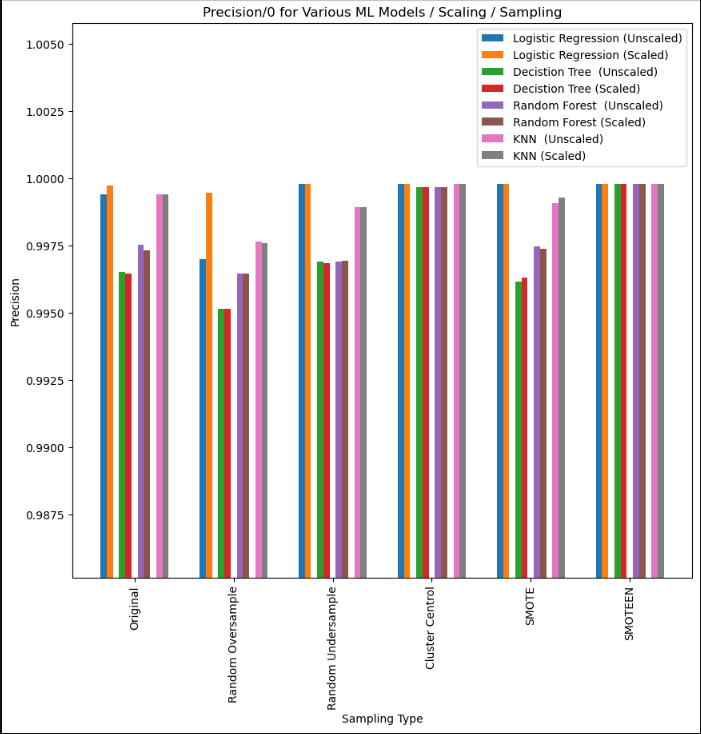

# Columbia Fintech Bootcamp: Module #12 Challenge

---

Feature Summary: Credit Risk Classification

Credit risk poses a classification problem that’s inherently imbalanced. This is because healthy loans easily outnumber risky loans. In this Challenge, I use various techniques to train and evaluate models with imbalanced classes. I used a dataset of historical lending activity from a peer-to-peer lending services company to build a model that can identify the creditworthiness of borrowers.

- Includes the following tasks:

    - Split the Data into Training and Testing Sets
    - Create various machine learning supervised learning models:  Logistic Regression, Decision Tree, Random Forest, KNN
    - Using all the above models, made predictions using various scaling formats: Original data, random oversampled data, random undersampled data, Cluster Centroid, SMOTE, and SMOTEEN
    - Additionally, evaluated the impact of scaling (normalizing) the input/original data set and its impact on prediction performance with the various models and scaling techniques.

---

## Technologies

This project leverages python 3.9 with the following packages:
- [pandas](https://github.com/pandas-dev/pandas) - A powerful data analysis toolkit.
- [numpy](https://numpy.org/) - A core library for scientific computing in Python
- [sklearn](https://scikit-learn.org/) - Simple and efficient tools for predictive data analysis
- [imblearn](https://imbalanced-learn.org/) - Provides tools when dealing with classification with imbalanced classes
- [matplotlib](https://matplotlib.org/) - Tools for creating static, animated, and interactive visualizations
- [seaborn](https://seaborn.pydata.org/) - Statistical data visualization tools

This project leverages python 3.9 with the following packages:

Jupyter Lab 3.3.2 is required

- *Jupyter Lab is primarily used as a web-based development environment for the notebooks, code, and data associated with this project.  Its flexible interface allows users to configure and arrange workflows in data science*

---

## Installation Guide

Before running the application first install the following dependencies.

```python
  pip install pandas
  pip install numpy
  pip install sklearn
  pip install imblearn
  pip install matplotlib
  pip install seaborn

```
*Assumption made for module challenge: the* **sys** *and Path module will not be required to be explicitely called out in Installation guide section*

To run Jupyter Lab, need to install Anaconda:
- [Anaconda](https://docs.anaconda.com/anaconda/install/) - an open-source distribution of the Python
---

## Usage

To run the Forecasting Net Prophet application, simply clone the repository and run the **credit_risk_resampling.ipynb** script in Jupyter Lab:

---

## Analysis

### Purpose
- Credit risk poses a classification problem that’s inherently imbalanced. This is because healthy loans easily outnumber risky loans. The purpose of this module challeng is to explore various techniques to train and evaluate models with imbalanced classes to help identify the creditworthiness of borrowers.

### Financial Information
- A dataset of historical lending activity from a peer-to-peer lending services company was used to build the various machine learning models

#### Machine Learning Models Implemented:
- Logistic Regression
- Decision Tree
- Random Forest
- KNN
#### Data Sampling Options Used:
- Original data
- Random Oversampling
- Random Undersampling
- Cluster Centroid
- SMOTE
- SMOTEEN 
<br><br>*Note all of the above machine learning models and sampling techniques were evaluated with and without scaling of the input feature data*

### Metrics Used For Analysis:
- **accuracy**:  measures how often the model was correct. It does so by calculating the ratio of the number of correct predictions to the total number of outcomes
- **precision**: measures how confident we are that the model correctly made the positive predictions
- **recall**: measures the number of actually high-risk loanthat the model correctly classified as high-risk loans
<br><br>
- Basic information gathered in this analysis includes: DataFrame printouts, value_counts (to explore the impact of different sampling techniques), balanced accuracy scores, confusion matrixes, classification reports, and bar plots of the different model prediciton results.

### Machine Learning Model Generation & Prediction Stages:
- **Display/review** the feature and target set data
- **Scale** the training set data (optionally for some models)
- **Instantiate** the machine learning model (e.g. Logistic Regression, Decision Tree, etc.)
- **Fit** the machine learning model by using the training data set
- Use the machine learning model to make **predictions** on teh test data set
- **Evaluate** the performance of the model (balanced_accuracy_score, confusion matrixes, classification, etc.)

## Classification Report Results

- Model #1: **Logistic Regression** (No Resampling)
>               precision    recall  f1-score   support
>
>           0       1.00      0.99      1.00     18765
>           1       0.85      0.91      0.88       619
>
>    accuracy                           0.99     19384
<br><br>
- Model #2: **Logistic Regression** (w/ *Random Oversampling*)
>               precision    recall  f1-score   support
>
>           0       1.00      0.99      1.00     18765
>           1       0.84      0.99      0.91       619
>
>    accuracy                           0.99     19384

## Summary

*The following is in regards to the core requirements for this module 12 challenge*

- Logistics regression analysis:\
-- "accuracy = 0.99".  The model predicted correctly 99% of the time that the loan was either healhty loan or a high risk loan\
-- "precision /0 (healthy loan) = 1.00".  Out of all the loans the model predicted would be a healthy loan (0), the model predicted this correctly 100% of the time\
-- "precision /1 (high-risk loan) = 0.84".  Out of all the loans the model predicted would be a high-risk loan (1), the model predicted this correctly 84% of the time\
-- "recall /0 (healthy loan) = 0.99".  Out of all the loans that were declared a healthy loan, the model predicted this outcome 99% of the time\
-- "recall /1 (high-risk loan) = 0.85".  Out of all the loans that were declared a high-risk loan, the model predicted this outcome 85% of the time
<br><br>
- Logistics Regression (w/ Random Oversampling) analysis:\
-- "accuracy = 0.99".  The model predicted correctly 99% of the time that the loan was either healhty loan or a high risk loan\
                       &nbsp;&nbsp;&nbsp;&nbsp;&nbsp;** No improvement using random oversampling compared to the original non oversampling accuracy score of 0.99 **\
-- "precision /0 (healthy loan) = 1.00".  Out of all the loans the model predicted would be a healthy loan (0), the model predicted this correctly 100% of the time\
                       &nbsp;&nbsp;&nbsp;&nbsp;&nbsp;** No improvement using random oversampling compared to the original non oversampling precision /0 score of 1.00**\
-- "precision /1 (high-risk loan) = 0.84".  Out of all the loans the model predicted would be a high-risk loan (1), the model predicted this correctly 84% of the time\
                       &nbsp;&nbsp;&nbsp;&nbsp;&nbsp;** No improvement using random oversampling compared to the original non oversampling precision /1 score of 0.84 **\
-- "recall /0 (healthy loan) = 0.99".  Out of all the loans that were declared a healthy loan, the model predicted this outcome 99% of the time\
                       &nbsp;&nbsp;&nbsp;&nbsp;&nbsp;** No improvement using random oversampling compared to the original non oversampling recall /0 score of 0.99**\
-- "recall /1 (high-risk loan) = 0.99".  Out of all the loans that were declared a high-risk loan, the model predicted this outcome 99% of the time
                       &nbsp;&nbsp;&nbsp;&nbsp;&nbsp;** Here we do have a considerable improvement using random oversampling compared to the original non oversampling recall /1 score of 0.85**\
<br><br>
In summary, the Logistics Regression model with Random Oversampling performed better and would be the recommended model (i.e. all benchmark parameters were similar, but the recall on the high-risk loans was signifcantly better)

---
## Addiitional Model Results 
    - Create various machine learning supervised learning models:  Logistic Regression, Decision Tree, Random Forest, KNN
    - Using all the above models, made predictions using various scaling formats: Original data, random oversampled data, random undersampled data, Cluster Centroid, SMOTE, and SMOTEEN





---

## Contributors

Contributors:
- Stratis Gavnoudias
---

## License

GNU GENERAL PUBLIC LICENSE Version 3, 29 June 2007
